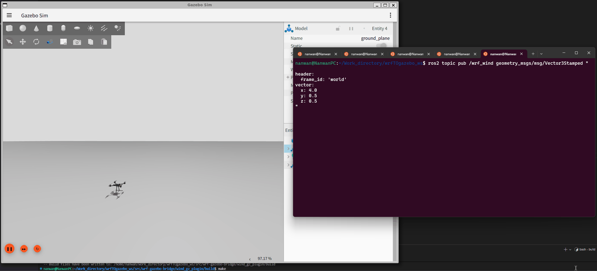

# wrf-gazebo-bridge


-purple?logo=gazebo)


WRF–Gazebo bridge for simulating realistic, time-varying 3D wind fields in ROS 2 and Gazebo Harmonic.  
It reads atmospheric wind from WRF `wrfout` NetCDF files, interpolates in space and time at the robot’s current latitude / longitude / altitude, publishes `/wrf_wind` in ROS 2, and applies the resulting aerodynamic forces and torques to a Gazebo model.

The Gazebo system plugin is designed to be reusable: you can run it with the WRF-based wind node in this repository, or feed it from any custom ROS 2 wind topic as a standalone aerodynamic drag plugin.

---

## Build and Install

### Dependencies

- Ubuntu 22.04
- ROS 2 Humble
- Gazebo Harmonic (`gz-sim8`)
- Python:
  - `netCDF4`
  - `numpy`
  - `yaml` (for the `wrf_wrf_info.py` helper script)

Recommended installation for Python dependencies:

```bash
sudo apt install python3-netcdf4 python3-numpy python3-yaml
```

### 1. Build the ROS 2 package

From the workspace root (for example `~/Work_directory/wrfTOgazebo_ws`):

```bash
colcon build --packages-select wrf_gazebo_bridge
source install/setup.bash
```

### 2. Build and install the Gazebo plugin

From this repository:

```bash
cd wind_gz_plugin
mkdir -p build
cd build
cmake ..
make
sudo make install
```

The plugin is installed to:

```text
/usr/lib/x86_64-linux-gnu/gz-sim-8/plugins
```

This is the default Gazebo Harmonic (`gz-sim8`) system plugin path on Ubuntu, so you do not need to set `GZ_SIM_SYSTEM_PLUGIN_PATH`.

---

## Usage

### 1. Configure the WRF wind node (YAML)

Configuration file: `config/wrf_wind_config.yaml`, example:

```yaml
wrf_wind_publisher:
  ros__parameters:
    wrf_file_path: "/absolute/path/to/wrfout_d01_2022-07-01_00_00_00"
    position_topic: "/robot_gpsfix"
    wind_topic: "/wrf_wind"
    use_3d_wind: true
    time_interpolation: "linear"
    time_offset_seconds: 0.0
    default_wind_x: 0.0
    default_wind_y: 0.0
    default_wind_z: 0.0
```

Notes:

- It is recommended to use an absolute path for `wrf_file_path` to avoid issues when the working directory changes.
- When the robot position is outside the WRF lat/lon domain, the wind falls back to the default value (usually 0).
- The time axis uses WRF `XTIME` (minutes). The node supports arbitrary time resolution with linear or nearest interpolation.

### 2. Start the WRF wind node

From your sourced workspace:

```bash
ros2 run wrf_gazebo_bridge wrf_wind_publisher
```

By default, the node will try to load parameters from the installed
`config/wrf_wind_config.yaml` in the `wrf_gazebo_bridge` share directory.  
You can still override any parameter via:

- CLI: `--ros-args -p wrf_file_path:=/some/other/file.nc`
- Custom params file: `--ros-args --params-file your_custom.yaml`

### 3. Add the plugin to your Gazebo model

Inside the `<model>` that should be affected by wind:

```xml
<plugin filename="libWindGzPlugin.so" name="wrf_gz::WindGzPlugin">
  <!-- Link where the aerodynamic wrench is applied -->
  <link_name>base_link</link_name>

  <!-- Geodetic reference point (lat / lon / alt) for the world origin -->
  <reference_latitude>30.0</reference_latitude>
  <reference_longitude>120.0</reference_longitude>
  <reference_altitude>0.0</reference_altitude>

  <!-- Air properties and simple drag coefficients (tune for your model) -->
  <fluid_density>1.225</fluid_density>           <!-- Air density kg/m^3 -->
  <reference_area>1.0</reference_area>           <!-- Reference area m^2 -->
  <linear_drag_coefficient>1.0</linear_drag_coefficient>
  <angular_drag_coefficient>1.0</angular_drag_coefficient>

  <!-- Optional safety limits for the applied wrench -->
  <max_force>200.0</max_force>
  <max_torque>50.0</max_torque>
</plugin>
```

World frame convention:

- `+X` points east  
- `+Y` points north  
- `+Z` points up

The plugin converts the model position in world coordinates to latitude / longitude / altitude and publishes it on `/robot_gpsfix`.

### 4. Start Gazebo and verify topics

Start your world as usual, for example:

```bash
gz sim your_world.sdf
```

Check that the plugin and wind node are working:

```bash
ros2 topic echo /robot_gpsfix
ros2 topic echo /wrf_wind
```

When the model moves inside the WRF domain:

- `/robot_gpsfix` latitude / longitude will change with the model pose.
- `/wrf_wind` will provide interpolated wind vectors at the current position.
- The model will experience translational and rotational aerodynamic drag.

The plugin only applies aerodynamic forces / torques when:

- There is at least one active publisher on `/wrf_wind`, and
- At least one wind message has been received.

If no node is publishing `/wrf_wind`, the plugin will still publish `/robot_gpsfix`,
but it will not apply any additional aerodynamic wrench to the model.

---

## Using Only the Aerodynamics Plugin (Without WRF)

You can also use the Gazebo plugin as a **generic aerodynamic drag plugin** driven by a ROS 2 wind topic, without using the WRF data or the `wrf_wind_publisher` node.

- If you only need aerodynamic forces / torques:
  1. Build and install the plugin as described above.
  2. Add the `<plugin>` block to your model SDF.
  3. Either:
     - Run `wrf_wind_publisher` to provide wind from WRF, or
     - Run your own node that publishes `/wrf_wind`.
     - If nothing publishes `/wrf_wind`, the plugin will not apply any forces.

- To drive the plugin with your own wind field:
  - Publish messages of type `geometry_msgs/msg/Vector3Stamped` on the `/wrf_wind` topic, for example:

    ```bash
    ros2 topic pub /wrf_wind geometry_msgs/msg/Vector3Stamped "
    header:
      frame_id: 'world'
    vector:
      x: 5.0
      y: 0.0
      z: 0.0
    "
    ```

  - The `vector` field is interpreted as the wind velocity in the world frame (m/s).
  - The plugin will still compute `/robot_gpsfix` based on the model pose, but you are free to ignore that topic if you do not use WRF.

---

## Inspecting WRF Files with `wrf_wrf_info.py`

For quick inspection of a WRF `wrfout` file and to verify that your `wrf_file_path`
in the YAML config is correct, you can use the helper script:

```bash
cd ~/Work_directory/wrfTOgazebo_ws/src/wrf-gazebo-bridge
python3 wrf_gazebo_bridge/wrf_wrf_info.py
```

Behavior:

- If `--wrf-file` is not provided, the script will:
  1. Look for `config/wrf_wind_config.yaml` in the source tree.
  2. If not found, try the installed share directory from `ament_index`.
  3. Read `wrf_file_path` from the `ros__parameters` section.
- If `--wrf-file` is provided, that path is used directly:

  ```bash
  python3 -m wrf_gazebo_bridge.wrf_wrf_info --wrf-file /path/to/wrfout_d01_...
  ```

The script prints:

- Latitude / longitude range and domain center
- Approximate horizontal extent (north-south / east-west, meters)
- Vertical height range (mass levels, meters)
- Terrain height and lowest mass-level height at the domain center
- Min / max / mean wind speed over the domain

---

## Troubleshooting

- **Gazebo cannot find the plugin**
  - Ensure `sudo make install` has been run.
  - Check that `/usr/lib/x86_64-linux-gnu/gz-sim-8/plugins/libWindGzPlugin.so` exists.

- **WRF file cannot be opened**
  - Verify that `wrf_file_path` in `config/wrf_wind_config.yaml` is a correct absolute path.
  - Make sure you have sourced `install/setup.bash` in your terminal.

- **Wind is always zero**
  - Check that the robot lat/lon is inside the WRF domain.
  - Check `use_3d_wind` and `time_interpolation` parameters in the YAML config.
  - Confirm that `/wrf_wind` has at least one publisher and the WRF node is running.

- **No aerodynamic effect when using custom wind**
  - Confirm that your custom node publishes `geometry_msgs/msg/Vector3Stamped` on `/wrf_wind`.
  - Check that the `vector` fields are non-zero and in the correct frame (`world`).

---

If you find this repository useful, please consider giving it a star to support our work. ⭐

